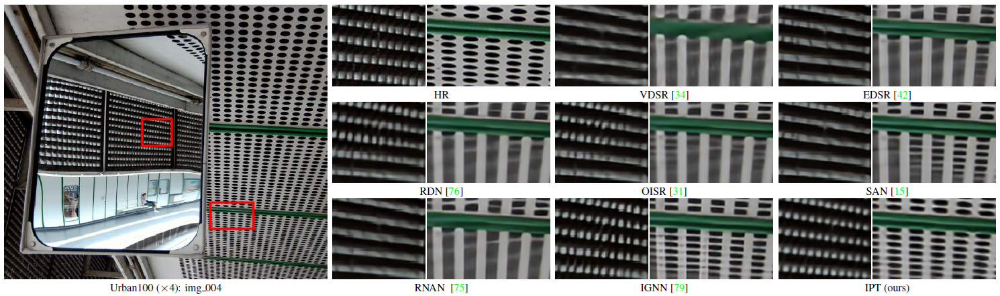
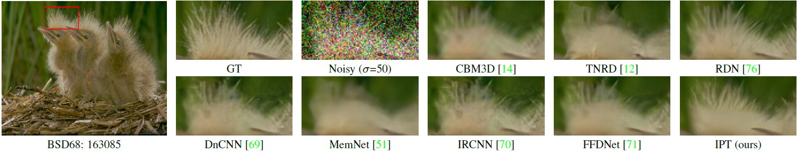

[](https://paperswithcode.com/sota/single-image-deraining-on-test100?p=pre-trained-image-processing-transformer)
[](https://paperswithcode.com/sota/color-image-denoising-on-mcmaster-sigma50?p=pre-trained-image-processing-transformer)
# **Pre**-Trained Image Processing Transformer (IPT)
By Hanting Chen, Yunhe Wang, Tianyu Guo, Chang Xu, Yiping Deng, Zhenhua Liu, Siwei Ma, Chunjing Xu, Chao Xu, Wen Gao. [[arXiv]](https://arxiv.org/abs/2012.00364)

We study the low-level computer vision task (such as denoising, super-resolution and deraining) and develop a new pre-trained model, namely, image processing transformer (IPT). We present to utilize the well-known ImageNet benchmark for generating a large amount of corrupted image pairs. The IPT model is trained on these images with multi-heads and multi-tails. The pre-trained model can therefore efficiently employed on desired task after fine-tuning. With only one pre-trained model, IPT outperforms the current state-of-the-art methods on various low-level benchmarks.

<p align="center">

</p>


## MindSpore Code

- [Official MindSpore code](https://gitee.com/mindspore/models/tree/master/research/cv/IPT)
- [Pretrained weights for super-resolution X4](https://www.mindspore.cn/resources/hub/details?noah-cvlab/gpu/1.1/ipt_v1.0_Set14_SR_x4)


## Requirements

- python 3
- pytorch == 1.4.0
- torchvision


## Dataset

The benchmark datasets can be downloaded as follows:

For super-resolution:

Set5,
Set14,
B100,
Urban100.

Please refer to [EDSR-PyTorch](https://github.com/sanghyun-son/EDSR-PyTorch) 

For denoising:

[CBSD68](https://www2.eecs.berkeley.edu/Research/Projects/CS/vision/bsds/),
Urban100.

For deraining:

Rain100.

Please refer to [PReNet](https://github.com/csdwren/PReNet) 

The result images are converted into YCbCr color space. The PSNR is evaluated on the Y channel only.

## Script Description

This is the inference script of IPT, you can following steps to finish the test of image processing tasks, like SR, denoise and derain, via the corresponding pretrained models.

### Script Parameter

For details about hyperparameters, see option.py.

## Evaluation

### Pretrained models

The pretrained models are available in [google drive](https://drive.google.com/drive/folders/1MVSdUX0YBExauG0fFz4ANiWTrq9xZEj7?usp=sharing)

### Evaluation Process

> Inference example:
> For SR x2,x3,x4:

```bash
python main.py --dir_data $DATA_PATH --pretrain $MODEL_PATH --data_test Set5+Set14+B100+Urban100 --scale $SCALE --test_only
```
> Note: path of images should be like: $MODEL_PATH/benchmark/Set5/HR/XXX.png and $MODEL_PATH/benchmark/Set5/LR_bicubic/XXX.png

> For Denoise 30,50:

```bash
python main.py --dir_data $DATA_PATH --pretrain $MODEL_PATH --data_test CBSD68+Urban100 --scale 1 --denoise --sigma $NOISY_LEVEL --test_only
```
> Note: path of images should be like: $MODEL_PATH/benchmark/CBSD68/XXX.png

> For derain:

```bash
python main.py --dir_data $DATA_PATH --pretrain $MODEL_PATH --scale 1 --derain --test_only
```

> Note: path of images should be like: $MODEL_PATH/Rain100L/rain-XXX.png and $MODEL_PATH/Rain100L/norain-XXX.png

## Results


- Detailed results on image super-resolution task.

<center>
    
|                         Method                          |   Scale   |     Set5     |    Set14     |     B100     |   Urban100   |
| :-----------------------------------------------------: | :-------: | :----------: | :----------: | :----------: | :----------: |
|    [VDSR](https://github.com/twtygqyy/pytorch-vdsr)     | X2 |    37.53     |    33.05     |    31.90     |    30.77     |
|  [EDSR](https://github.com/sanghyun-son/EDSR-PyTorch)   | X2 |    38.11     |    33.92     |    32.32     |    32.93     |
|       [RCAN](https://github.com/yulunzhang/RCAN)        | X2 |    38.27     |    34.12     |    32.41     |    33.34     |
|        [RDN](https://github.com/yulunzhang/RDN)         | X2 |    38.24     |    34.01     |    32.34     |    32.89     |
| [OISR-RK3](https://github.com/HolmesShuan/OISR-PyTorch) | X2 |    38.21     |    33.94     |    32.36     |    33.03     |
|       [RNAN](https://github.com/yulunzhang/RNAN)        | X2 |    38.17     |    33.87     |    32.32     |    32.73     |
|          [SAN](https://github.com/hszhao/SAN)           | X2 | <u>38.31</u> |    34.07     | <u>32.42</u> |     33.1     |
|          [HAN](https://github.com/wwlCape/HAN)          | X2 |    38.27     | <u>34.16</u> |    32.41     | <u>33.35</u> |
|         [IGNN](https://github.com/sczhou/IGNN)          | X2 |    38.24     |    34.07     |    32.41     |    33.23     |
|                       IPT (ours)                        | X2 |  **38.37**   |  **34.43**   |  **32.48**   |  **33.76**   |


|                         Method                          |   Scale   |     Set5     |    Set14     |     B100     |   Urban100   |
| :-----------------------------------------------------: | :-------: | :----------: | :----------: | :----------: | :----------: |
|    [VDSR](https://github.com/twtygqyy/pytorch-vdsr)     | X3 |    33.67     |    29.78     |    28.83     |    27.14     |
|  [EDSR](https://github.com/sanghyun-son/EDSR-PyTorch)   | X3 |    34.65     |    30.52     |    29.25     |    28.80     |
|       [RCAN](https://github.com/yulunzhang/RCAN)        | X3 |    34.74     |    30.65     |    29.32     |    29.09     |
|        [RDN](https://github.com/yulunzhang/RDN)         | X3 |    34.71     |    30.57     |    29.26     |    28.80     |
| [OISR-RK3](https://github.com/HolmesShuan/OISR-PyTorch) | X3 |    34.72     |    30.57     |    29.29     |    28.95     |
|       [RNAN](https://github.com/yulunzhang/RNAN)        | X3 |    34.66     |    30.52     |    29.26     |    28.75     |
|          [SAN](https://github.com/hszhao/SAN)           | X3 | <u>34.75</u> |    30.59     | <u>29.33</u> |    28.93     |
|          [HAN](https://github.com/wwlCape/HAN)          | X3 | <u>34.75</u> | <u>30.67</u> |    29.32     | <u>29.10</u> |
|         [IGNN](https://github.com/sczhou/IGNN)          | X3 |    34.72     |    30.66     |    29.31     |    29.03     |
|                       IPT (ours)                        | X3 |  **34.81**   |  **30.85**   |  **29.38**   |  **29.49**   |


|                         Method                          |   Scale   |     Set5     |    Set14     |     B100     |   Urban100   |
| :-----------------------------------------------------: | :-------: | :----------: | :----------: | :----------: | :----------: |
|    [VDSR](https://github.com/twtygqyy/pytorch-vdsr)     | X4 |    31.35     |    28.02     |    27.29     |    25.18     |
|  [EDSR](https://github.com/sanghyun-son/EDSR-PyTorch)   | X4 |    32.46     |    28.80     |    27.71     |    26.64     |
|       [RCAN](https://github.com/yulunzhang/RCAN)        | X4 | <u>32.63</u> |    28.87     |    27.77     |    26.82     |
|          [SAN](https://github.com/hszhao/SAN)           | X4 |  **32.64**   | <u>28.92</u> |    27.78     |    26.79     |
|        [RDN](https://github.com/yulunzhang/RDN)         | X4 |    32.47     |    28.81     |    27.72     |    26.61     |
| [OISR-RK3](https://github.com/HolmesShuan/OISR-PyTorch) | X4 |    32.53     |    28.86     |    27.75     |    26.79     |
|       [RNAN](https://github.com/yulunzhang/RNAN)        | X4 |    32.49     |    28.83     |    27.72     |    26.61     |
|          [HAN](https://github.com/wwlCape/HAN)          | X4 |  **32.64**   |    28.90     | <u>27.80</u> | <u>26.85</u> |
|         [IGNN](https://github.com/sczhou/IGNN)          | X4 |    32.57     |    28.85     |    27.77     |    26.84     |
|                       IPT (ours)                        | X4 |  **32.64**   |  **29.01**   |  **27.82**   |  **27.26**   |

</center>
    
- Super-resolution result

<p align="center">

</p>

- Denoising result

<p align="center">

</p>

- Derain result

<p align="center">

</p>


## Citation

```
@misc{chen2020pre,
      title={Pre-Trained Image Processing Transformer}, 
      author={Chen, Hanting and Wang, Yunhe and Guo, Tianyu and Xu, Chang and Deng, Yiping and Liu, Zhenhua and Ma, Siwei and Xu, Chunjing and Xu, Chao and Gao, Wen},
      year={2021},
      eprint={2012.00364},
      archivePrefix={arXiv},
      primaryClass={cs.CV}
}
```


## Acknowledgement

* Main code from [EDSR-PyTorch](https://github.com/sanghyun-son/EDSR-PyTorch)  
* Transformer code from [detr](https://github.com/facebookresearch/detr)
