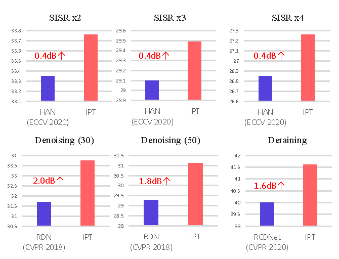

# **Pre**-Trained Image Processing Transformer (IPT)
By Hanting Chen, Yunhe Wang, Tianyu Guo, Chang Xu, Yiping Deng, Zhenhua Liu, Siwei Ma, Chunjing Xu, Chao Xu, Wen Gao. [[arXiv]](https://arxiv.org/abs/2012.00364)

We study the low-level computer vision task (such as denoising, super-resolution and deraining) and develop a new pre-trained model, namely, image processing transformer (IPT). We present to utilize the well-known ImageNet benchmark for generating a large amount of corrupted image pairs. The IPT model is trained on these images with multi-heads and multi-tails. The pre-trained model can therefore efficiently employed on desired task after fine-tuning. With only one pre-trained model, IPT outperforms the current state-of-the-art methods on various low-level benchmarks.

<p align="center">

</p>


## MindSpore Code

- [Official MindSpore code](https://gitee.com/mindspore/mindspore/tree/master/model_zoo/research/cv/IPT)
- [Pretrained weights for super-resolution X4](https://www.mindspore.cn/resources/hub/details?noah-cvlab/gpu/1.1/ipt_v1.0_Set14_SR_x4)


## News

- Pytorch pre-trained model will be released in June! 


## Requirements

- python 3
- pytorch >= 1.4.0
- torchvision


## Usage

Coming soon!


## Results


<p align="center">

</p>

- Detailed results on image super-resolution task.

|                         Method                          |   Scale   |     Set5     |    Set14     |     B100     |   Urban100   |
| :-----------------------------------------------------: | :-------: | :----------: | :----------: | :----------: | :----------: |
|    [VDSR](https://github.com/twtygqyy/pytorch-vdsr)     | $\times$2 |    37.53     |    33.05     |    31.90     |    30.77     |
|  [EDSR](https://github.com/sanghyun-son/EDSR-PyTorch)   | $\times$2 |    38.11     |    33.92     |    32.32     |    32.93     |
|       [RCAN](https://github.com/yulunzhang/RCAN)        | $\times$2 |    38.27     |    34.12     |    32.41     |    33.34     |
|        [RDN](https://github.com/yulunzhang/RDN)         | $\times$2 |    38.24     |    34.01     |    32.34     |    32.89     |
| [OISR-RK3](https://github.com/HolmesShuan/OISR-PyTorch) | $\times$2 |    38.21     |    33.94     |    32.36     |    33.03     |
|       [RNAN](https://github.com/yulunzhang/RNAN)        | $\times$2 |    38.17     |    33.87     |    32.32     |    32.73     |
|          [SAN](https://github.com/hszhao/SAN)           | $\times$2 | <u>38.31</u> |    34.07     | <u>32.42</u> |     33.1     |
|          [HAN](https://github.com/wwlCape/HAN)          | $\times$2 |    38.27     | <u>34.16</u> |    32.41     | <u>33.35</u> |
|         [IGNN](https://github.com/sczhou/IGNN)          | $\times$2 |    38.24     |    34.07     |    32.41     |    33.23     |
|                       IPT (ours)                        | $\times$2 |  **38.37**   |  **34.43**   |  **32.48**   |  **33.76**   |


|                         Method                          |   Scale   |     Set5     |    Set14     |     B100     |   Urban100   |
| :-----------------------------------------------------: | :-------: | :----------: | :----------: | :----------: | :----------: |
|    [VDSR](https://github.com/twtygqyy/pytorch-vdsr)     | $\times$3 |    33.67     |    29.78     |    28.83     |    27.14     |
|  [EDSR](https://github.com/sanghyun-son/EDSR-PyTorch)   | $\times$3 |    34.65     |    30.52     |    29.25     |    28.80     |
|       [RCAN](https://github.com/yulunzhang/RCAN)        | $\times$3 |    34.74     |    30.65     |    29.32     |    29.09     |
|        [RDN](https://github.com/yulunzhang/RDN)         | $\times$3 |    34.71     |    30.57     |    29.26     |    28.80     |
| [OISR-RK3](https://github.com/HolmesShuan/OISR-PyTorch) | $\times$3 |    34.72     |    30.57     |    29.29     |    28.95     |
|       [RNAN](https://github.com/yulunzhang/RNAN)        | $\times$3 |    34.66     |    30.52     |    29.26     |    28.75     |
|          [SAN](https://github.com/hszhao/SAN)           | $\times$3 | <u>34.75</u> |    30.59     | <u>29.33</u> |    28.93     |
|          [HAN](https://github.com/wwlCape/HAN)          | $\times$3 | <u>34.75</u> | <u>30.67</u> |    29.32     | <u>29.10</u> |
|         [IGNN](https://github.com/sczhou/IGNN)          | $\times$3 |    34.72     |    30.66     |    29.31     |    29.03     |
|                       IPT (ours)                        | $\times$3 |  **34.81**   |  **30.85**   |  **29.38**   |  **29.49**   |


|                         Method                          |   Scale   |     Set5     |    Set14     |     B100     |   Urban100   |
| :-----------------------------------------------------: | :-------: | :----------: | :----------: | :----------: | :----------: |
|    [VDSR](https://github.com/twtygqyy/pytorch-vdsr)     | $\times$4 |    31.35     |    28.02     |    27.29     |    25.18     |
|  [EDSR](https://github.com/sanghyun-son/EDSR-PyTorch)   | $\times$4 |    32.46     |    28.80     |    27.71     |    26.64     |
|       [RCAN](https://github.com/yulunzhang/RCAN)        | $\times$4 | <u>32.63</u> |    28.87     |    27.77     |    26.82     |
|          [SAN](https://github.com/hszhao/SAN)           | $\times$4 |  **32.64**   | <u>28.92</u> |    27.78     |    26.79     |
|        [RDN](https://github.com/yulunzhang/RDN)         | $\times$4 |    32.47     |    28.81     |    27.72     |    26.61     |
| [OISR-RK3](https://github.com/HolmesShuan/OISR-PyTorch) | $\times$4 |    32.53     |    28.86     |    27.75     |    26.79     |
|       [RNAN](https://github.com/yulunzhang/RNAN)        | $\times$4 |    32.49     |    28.83     |    27.72     |    26.61     |
|          [HAN](https://github.com/wwlCape/HAN)          | $\times$4 |  **32.64**   |    28.90     | <u>27.80</u> | <u>26.85</u> |
|         [IGNN](https://github.com/sczhou/IGNN)          | $\times$4 |    32.57     |    28.85     |    27.77     |    26.84     |
|                       IPT (ours)                        | $\times$4 |  **32.64**   |  **29.01**   |  **27.82**   |  **27.26**   |

- Super-resolution result

<p align="center">

</p>

- Denoising result

<p align="center">

</p>

- Derain result

<p align="center">

</p>


## Citation

```
@misc{chen2020pre,
      title={Pre-Trained Image Processing Transformer}, 
      author={Chen, Hanting and Wang, Yunhe and Guo, Tianyu and Xu, Chang and Deng, Yiping and Liu, Zhenhua and Ma, Siwei and Xu, Chunjing and Xu, Chao and Gao, Wen},
      year={2021},
      eprint={2012.00364},
      archivePrefix={arXiv},
      primaryClass={cs.CV}
}
```


